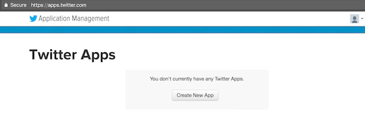
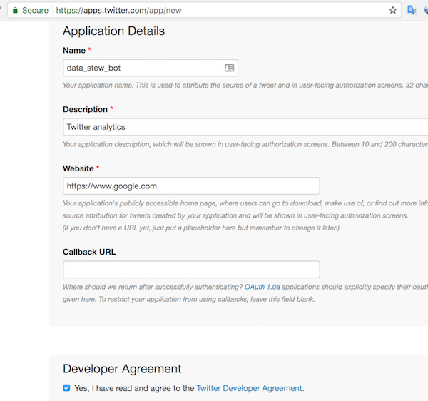
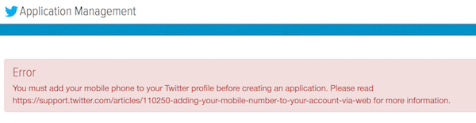
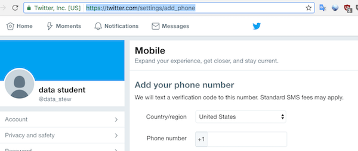
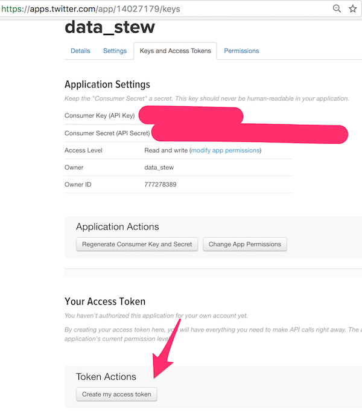
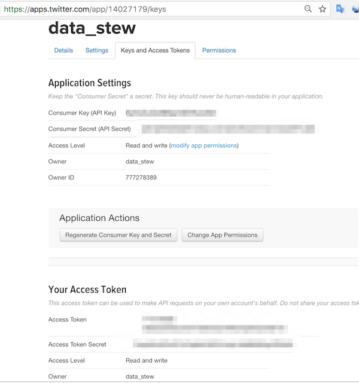

## Twitter API account and app setup

* Take the following steps to obtain the API keys. 
  * Go to the URL `https://apps.twitter.com/` and create a new Twitter app.

  

  * In the next screen, add your app's name, description and any valid URL e.g. `https://www.google.com`. 
  * Check the Twitter Developer Agreement box and click Create Twitter Application.

  

  * You may encounter an error message stating that you must enter their phone number.

  

  * In that case, type in the url `https://twitter.com/settings/add_phone` and enter your phone number.

  

  * Next, return to `https://apps.twitter.com`, click on the `Keys and Access Tokens` tab at the top, then at the bottom of that screen, under `Token Actions`, click on the `Create my access token` button.

  

  * Finally, you will have the four pieces of information necessary to create our apps: Consumer Key (API Key), Consumer Secret (API Secret), Access Token, and Access Token Secret.

  

* Please explore the [Tweepy documentation](http://docs.tweepy.org/en/v3.5.0/getting_started.html?)
