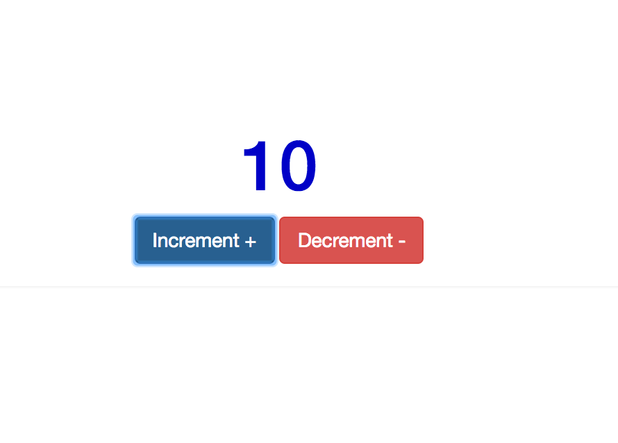
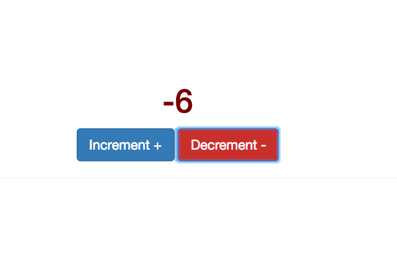

# Click Me Until I'm Blue in the Face

In this activity you will practice using JavaScript to reference DOM elements, listen for events, and manipulate the DOM.

## Instructions

### Part I

* This activity is builds on the previous instructor demo.

* Update the JavaScript code so that with each click, the counter increases by **two**.

### Part II

* With each click on the `Increment` button, the font size of the count should increase by, say, two pixels.

* With each click on the `Decrement` button, the font size of the count should decrease by, say, two pixels.

### Part III

* Update the JavaScript code so that with each click on the `Increment` button, the font changes to a deeper hue of blue.

* Update the JavaScript code so that with each click on the `Decrement` button, the font changes to a deeper hue of red.

* Consult the `Resources` links below for information on how you might accomplish this task.

* Hints: use RGB properties to change the color. When you increase the `blue` value by 30, you might want to decrease the `red` value by 30, and vice versa.

  

  

## Resources

* [https://stackoverflow.com/questions/5586703/how-to-change-fontsize-by-javascript](https://stackoverflow.com/questions/5586703/how-to-change-fontsize-by-javascript)

* [https://stackoverflow.com/questions/2173229/how-do-i-write-a-rgb-color-value-in-javascript](https://stackoverflow.com/questions/2173229/how-do-i-write-a-rgb-color-value-in-javascript)
