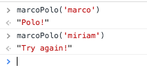
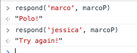

# Marco Polo

## Instructions

* In this activity, we will create a JavaScript version of the Marco Polo game. [https://en.wikipedia.org/wiki/Marco_Polo_(game)](https://en.wikipedia.org/wiki/Marco_Polo_(game))

### Part I

* Create a simple function called `marcoPolo`. It will take an argument called `heardWord`. When the function is called, and the argument is "Marco" (or "marco"), it will return "Polo!" With any other argument, it will return "Try again!"

  
  

### Part II

* Now create two functions. The first should be a generic function that takes two arguments: a string and a callback function. 

* The callback function should be a function specific to "Marco" and "Polo." It is executed, or called, in response to the first function, and the rules are the same as Part I. When this function hears "Marco," it should return "Polo!" With any other argument, it should return "Try again!"

  
