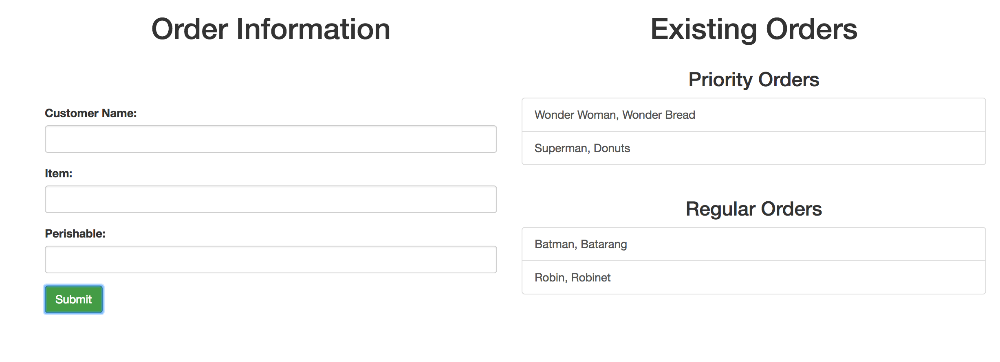

# Customer Orders

## Instructions

* In this activity, you will create a JavaScript-based system to keep track of incoming orders for a fictional small business.

* Each order will have three pieces of information: the name of the customer, the name of the item ordered, and its perishability.

* When an order is submitted, it should be displayed under `Priority Orders` if the item is perishable, and under `Regular Orders` if it is not perishable. It should look something like this:

  

* Bonus: add a functionality to delete an individual item from the page when it is clicked.

## Hints

* In order to solve the bonus, you will need to research how to delete an individual element upon clicking. One way to accomplish this task is to navigate the DOM from the clicked element to identify its parent element, then remove its child element. [https://developer.mozilla.org/en-US/docs/Web/API/Node/parentElement](https://developer.mozilla.org/en-US/docs/Web/API/Node/parentElement)
