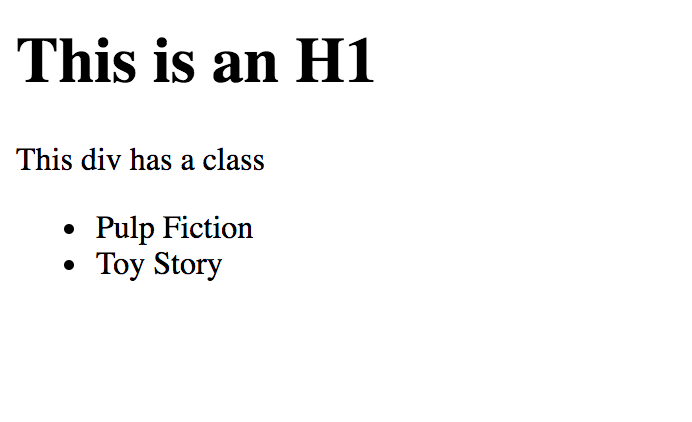
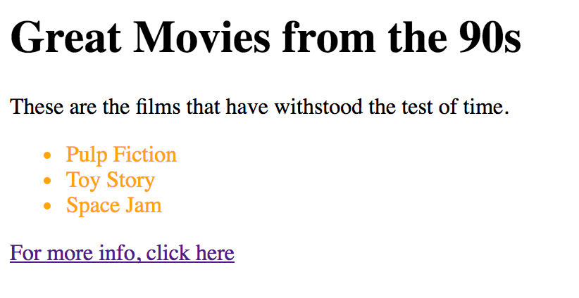

# D3 Select

## Instructions

* `index.html` currently looks like this:

  
  
* Use D3, and only D3, to modify the page, so that it looks like this:
  
  

* Further instructions are in `index.html`  
  
* Good luck!  